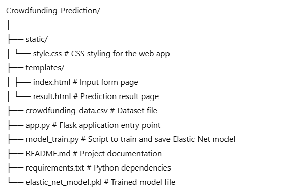
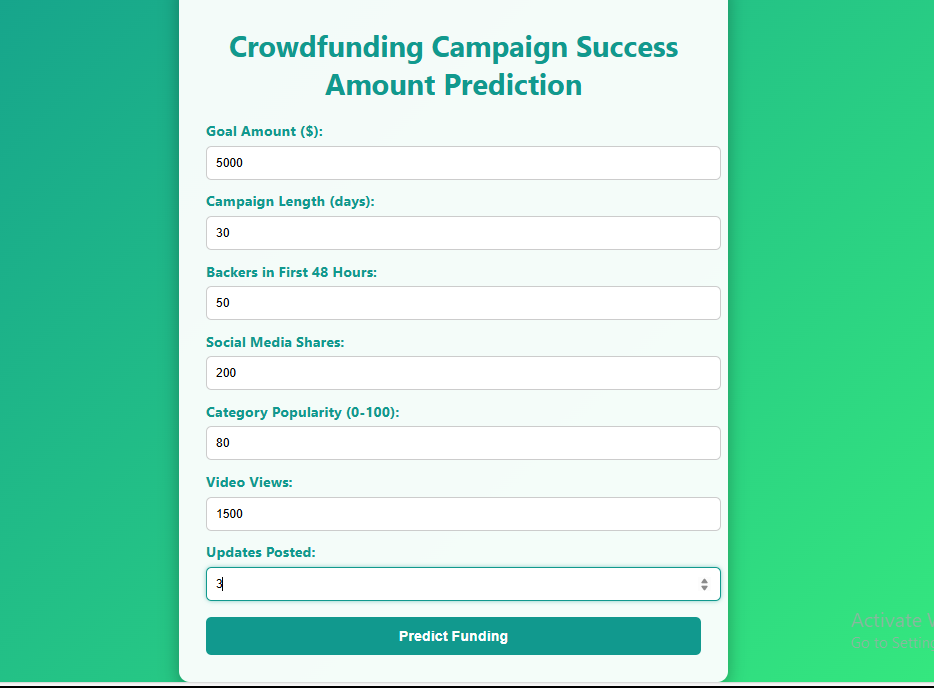
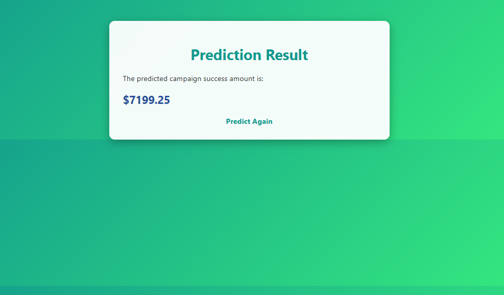

# Crowdfunding Campaign Success Amount Prediction (Elastic Net Regression)

A **Flask-based Machine Learning web application** that predicts the expected success amount of a crowdfunding campaign based on pre-launch metrics.  
The prediction is powered by **Elastic Net Regression**, which combines L1 (Lasso) and L2 (Ridge) regularization for accurate results with correlated features.

---

### Overview
This project allows users to input campaign details such as goal amount, campaign length, backers in the first 48 hours, and social media shares to get an estimated total funding amount.  
It is designed for entrepreneurs, investors, and marketing teams to predict campaign outcomes before launch.

---

### Features
- Predicts crowdfunding campaign total funding before launch  
- Uses **Elastic Net Regression** for robust predictions  
- Accepts multiple input features related to campaign performance  
- Responsive **HTML/CSS frontend**  
- Flask-powered backend for real-time predictions  

---

### Tech Stack
- **Python 3.x**  
- **Flask**  
- **scikit-learn**  
- **pandas**, **numpy**  
- **HTML/CSS**  

---

### Project Structure

---

### Installation & Setup

#### 1. Clone the Repository

git clone https://github.com/yourusername/crowdfunding-prediction.git
cd crowdfunding-prediction

#### 2. Install Dependencies

pip install -r requirements.txt

#### 3. Train the Model

python model_train.py
This will create and save the trained model file (elastic_net_model.pkl).

#### 4. Run the Web App

python app.py
Open in your browser:

http://127.0.0.1:5000/

### Use Cases

- Predicting crowdfunding campaign success before launch

- Helping entrepreneurs and marketers optimize strategies

- Demonstrating Elastic Net Regression in business applications

### Future Enhancements

- Integrate with real crowdfunding platform APIs for live predictions

- Allow comparison with Lasso and Ridge Regression models

- Deploy online via Heroku, Render, or similar platforms

## Screenshots

### Input Page

### Result Page

